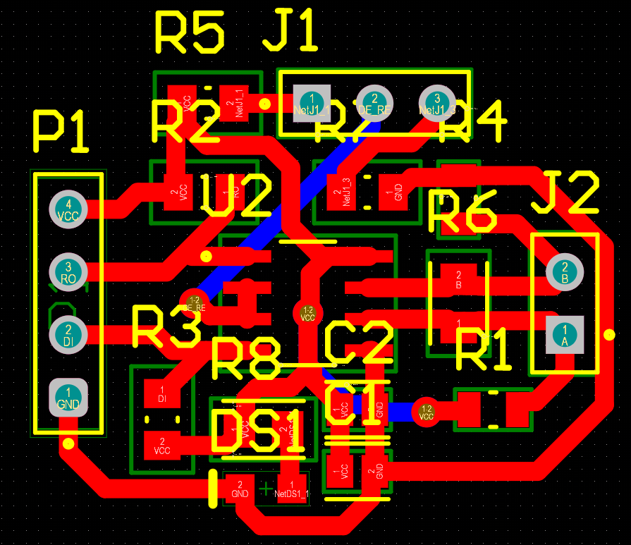

# Custom RS485 Communication Module - A Reverse-Engineering & PCB Design Project

This repository documents the complete design cycle for a custom 2-layer RS485 communication module. The project was undertaken to develop a deep, fundamental understanding of industrial communication hardware by reverse-engineering a commercial module and then replicating its functionality with a custom-designed Printed Circuit Board (PCB).

---

## Project Overview

In complex robotics systems, robust communication between microcontrollers is critical, especially in electrically noisy environments. RS485 is an industry standard for this, but commercially available modules often lack the specific form factor or features needed for a custom robot. This project involved the full process of analyzing a commercial module, designing a custom schematic, and laying out a 2-layer PCB for fabrication.

---

## Hardware Design & Schematic

The core of the design is the MAX485ESA+ transceiver IC. The schematic was designed to replicate the standard application circuit, including pull-up and pull-down resistors for fail-safe biasing, and a termination resistor for signal integrity. All passive components were carefully selected to ensure reliable operation.

**The complete circuit schematic is shown below:**

---

## PCB Layout & Signal Integrity

The 2-layer PCB was designed in Altium to be compact while adhering to best practices for signal integrity in a differential pair communication system.

*   **Differential Pair Routing:** The critical 'A' and 'B' signal lines were routed as a tightly coupled differential pair with consistent spacing to maintain a target impedance and maximize common-mode noise rejection.
*   **Ground Plane:** A large, contiguous ground plane was used on the bottom layer to provide a stable return path and shield the signal traces from noise.
*   **Component Placement:** Components were placed to minimize trace lengths, especially for the high-speed differential pair and the decoupling capacitors.

**The final 2-layer PCB layout is shown below:**

